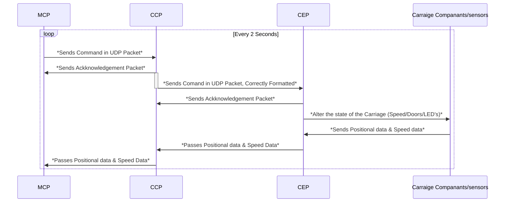

```mermaid
sequenceDiagram
loop Every 2 Seconds
MCP ->> CCP: *Sends Command in UDP Packet*
CCP ->> MCP: *Sends Ackknowledgement Packet*
activate CCP
CCP ->> CEP: *Sends Comand in UDP Packet, Correctly Formatted*
deactivate CCP
CEP ->> CCP: *Sends Ackknowledgement Packet*
CEP ->> Carraige Companants/sensors: *Alter the state of the Carriage (Speed/Doors/LED's)*
Carraige Companants/sensors ->> CEP: *Sends Positional data & Speed data*
CEP ->> CCP: *Passes Positional data & Speed Data*
CCP ->> MCP: *Passes Positional data & Speed Data*
end
```
